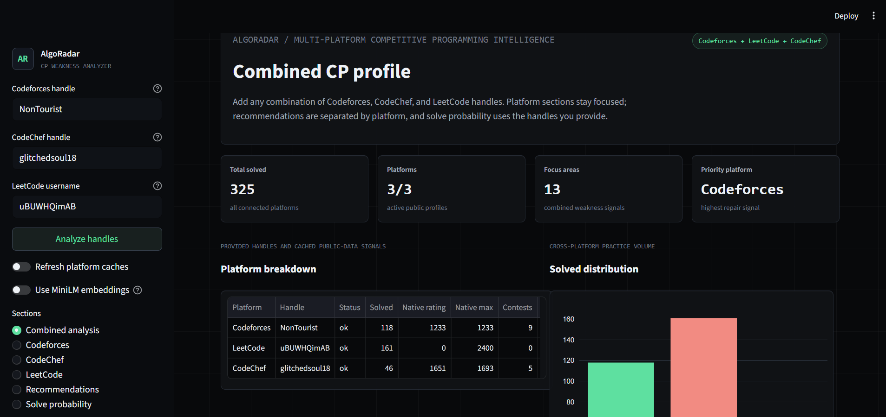
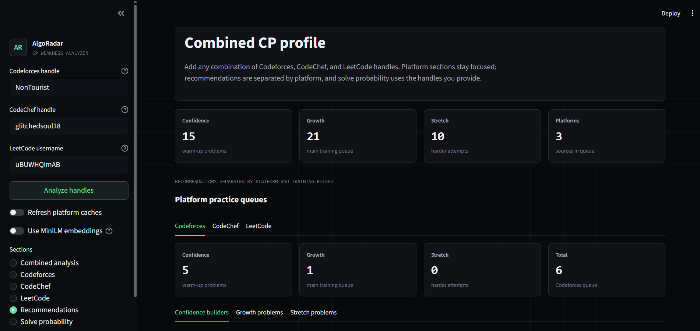
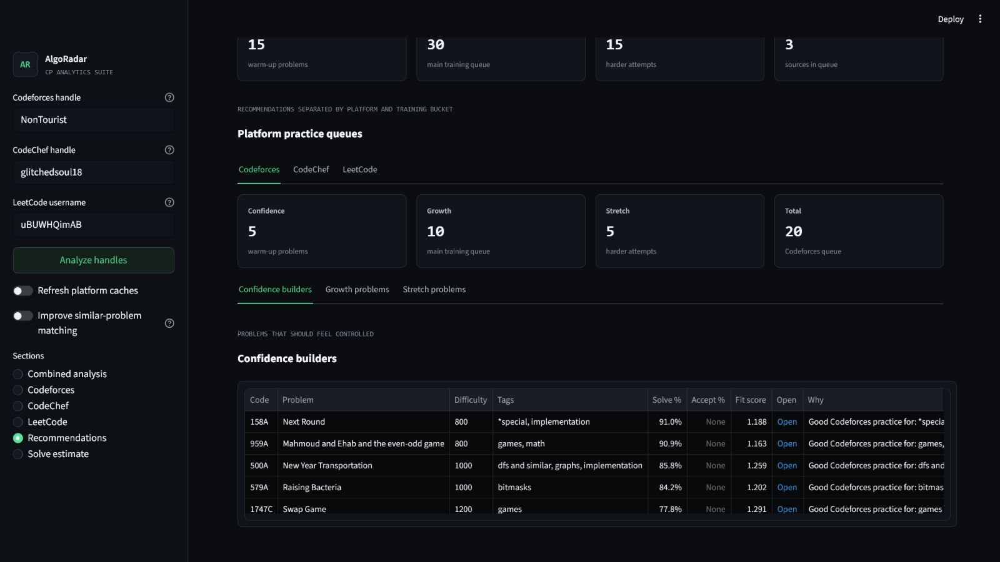
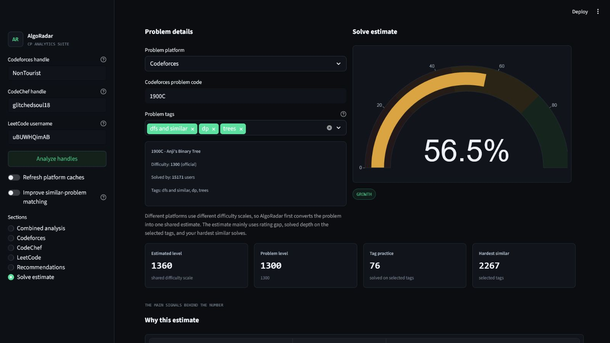

# AlgoRadar



**AlgoRadar | Competitive Programming Analytics and Problem Recommender**

AlgoRadar is a competitive programming analytics and recommendation system for Codeforces, CodeChef, and LeetCode. A user enters any combination of the three handles, and the app returns platform-wise analytics, focus areas, practice recommendations, and practical solve estimates from the handles provided.

The goal is not just to show charts. AlgoRadar builds a full data pipeline: API ingestion, caching, data cleaning, feature engineering, transparent scoring rules, calibrated solve estimates, problem ranking, and similar-problem search. Codeforces has the deepest signal because its official API exposes verdict-level submissions. LeetCode and CodeChef are normalized into the same product experience using their public profile, contest, topic, and practice-problem data.

## Features

- Optional Codeforces, CodeChef, and LeetCode handle inputs
- Live Codeforces handle analysis
- LeetCode profile, difficulty, topic, contest, and recommendation analysis
- CodeChef profile, rating trend, focus areas, and rating-band recommendations
- Combined cross-platform summary when at least two handles are provided
- Combined focus map
- Platform-separated practice queues
- Success rate by difficulty
- Tag-wise success and solved-depth analysis
- Most failed tags
- WA/TLE/runtime/compile verdict distribution
- Solved problem difficulty distribution
- Contest performance trend
- Focus table for every tag
- Transparent rule-based tag scoring
- Next-contest performance band prediction
- Practical solve-estimate model
- Confidence/growth/stretch recommendation queues
- Similar-but-harder problem retrieval
- Progress tracking
- Clean Streamlit dashboard

## Screens

1. Combined analysis
2. Codeforces
3. CodeChef
4. LeetCode
5. Recommendations
6. Solve estimate

## Visual Preview

### Combined Analysis


### Recommendations Overview



### Recommendation Table



### Solve Estimate



## Tech Stack

- Python
- Streamlit
- pandas
- scikit-learn
- Plotly
- Codeforces API
- LeetCode GraphQL public profile data
- CodeChef public profile and practice-problem data
- Fast similar-problem search
- Optional local MiniLM matching for better similar-problem results

## Recommendation and Probability Logic

AlgoRadar does not recommend problems by rating alone. Every recommendation is scored from a user-specific feature row built from the handle data available for that platform.

The solve estimate uses practical signals such as:

- problem rating or estimated difficulty
- estimated user level
- rating gap
- attempts on related tags
- solved count on related tags
- average solved difficulty on related tags
- hardest solved difficulty on related tags
- total solved volume
- inferred recent failures
- problem popularity
- tag count
- confidence in the problem difficulty source

Success rate is intentionally not the main signal. Public accepted submissions can be inflated by editorials or AI help, so AlgoRadar gives more importance to solved volume, tag depth, hardest solved difficulty, and the gap between the target problem and the user's demonstrated level.

Recommendations are then ranked using:

- solve-estimate bucket fit
- focus-tag similarity
- hardest-solved ceiling gap
- available evidence strength
- problem popularity
- difficulty confidence
- diversity across tags and rating bands

The result is split into platform-specific queues:

- `confidence`: high-probability problems for momentum
- `growth`: sweet-spot problems for skill improvement
- `stretch`: harder problems that are still realistic

Codeforces uses the richest signal because it has official problem ratings, tags, solved counts, and verdict-level user submissions. CodeChef and LeetCode use dynamic platform-specific scorecards from public rating, topic, contest, difficulty, and practice-problem signals instead of fixed hardcoded percentages.

## How It Works

AlgoRadar runs this pipeline:

1. Fetch Codeforces submissions, contest rating history, and problemset metadata.
2. Fetch optional LeetCode and CodeChef profiles only when their handles are added and their screens need the data.
3. Cache API/profile/problem-catalog responses locally in `data/cache/` so repeated runs are faster.
4. Convert raw platform data into normalized pandas feature tables.
5. Compute analytics such as success by difficulty, tag/topic coverage, verdict distribution, difficulty mix, and contest trends.
6. Score focus areas using transparent rules first.
7. Estimate the next-contest performance band from contest history, rating trend, solved volume, and recent success.
8. Build solve-estimate rows from rating gap, solved depth, tag evidence, recent failures, and popularity.
9. Apply a monotonic scorecard so harder problems do not randomly receive higher estimates.
10. Keep same-level problems realistic instead of treating them as guaranteed solves.
11. Rank problems into confidence, growth, and stretch queues with duplicate and diversity controls.
12. Build a similar-problem search layer using a fast local matcher by default.

The app uses live Codeforces data by default. If the API is unavailable, the backend has a reproducible sample-data fallback so the pipeline can still be tested.

## Metric Definitions

AlgoRadar avoids treating every number as equally meaningful. The main user-facing metrics are:

- **Current rating**: official latest rating for that platform only.
- **Max rating**: official peak rating for that platform only.
- **Platform rating**: a platform's own rating scale. AlgoRadar does not compare Codeforces, CodeChef, and LeetCode rating numbers as if they mean the same thing.
- **Shared difficulty scale**: an internal difficulty reference used only by solve estimate. CodeChef and LeetCode-style difficulties are mapped through `data/platform_calibration.csv`.
- **Recent success**: accepted-submission rate across the latest submissions.
- **Success by difficulty**: success rate grouped by official or estimated problem rating.
- **Hardest solved**: highest-rated accepted problem for a tag.
- **Focus score**: a topic score based on low success, recent failures, and attempt volume.
- **Solve estimate**: a practical estimate that prioritizes rating gap, solved volume, hardest solved difficulty, average solved difficulty, and the selected problem tags. Success rate is intentionally not the main signal because accepted submissions can be distorted by AI/editorial help.
- **Rating source**: `official` means Codeforces provides the problem rating; `estimated` means AlgoRadar inferred it from problem index and solved count.
- **LeetCode problem reference**: LeetCode has Easy/Medium/Hard labels, topic tags, acceptance stats, and a frontend problem number. It does not expose an official problem rating or the original contest slot through the public problem lookup, so AlgoRadar lets the user add an optional Q1-Q4 contest-slot reference when known.
- **LeetCode focus areas**: coverage-based signal from public solved topic counters. LeetCode does not expose full public verdict history for every solved/failed problem.
- **CodeChef focus areas**: rating-history and practice-volume signal from the public profile. CodeChef public solved profiles do not expose reliable tag-level verdict history.
- **Combined solved**: sum of public solved-count signals across connected platforms. It is useful for progress direction, not as a perfect apples-to-apples skill rating.

## Setup

### 1. Clone the Repository

```bash
git clone https://github.com/drawmebaaz/AlgoRadar.git
cd AlgoRadar
```

### 2. Create a Virtual Environment

#### Windows PowerShell

```powershell
python -m venv .venv
.\.venv\Scripts\Activate.ps1
```

If PowerShell blocks activation, run this once:

```powershell
Set-ExecutionPolicy -Scope CurrentUser RemoteSigned
```

Then activate again:

```powershell
.\.venv\Scripts\Activate.ps1
```

#### Windows Command Prompt

```cmd
python -m venv .venv
.venv\Scripts\activate.bat
```

#### macOS / Linux

```bash
python3 -m venv .venv
source .venv/bin/activate
```

### 3. Install Dependencies

#### Windows

```powershell
python -m pip install --upgrade pip
python -m pip install --upgrade -r requirements.txt
```

#### macOS / Linux

```bash
python3 -m pip install --upgrade pip
python3 -m pip install --upgrade -r requirements.txt
```

## Run the App

#### Windows

```powershell
streamlit run app.py
```

#### macOS / Linux

```bash
streamlit run app.py
```

Then open the local URL shown in the terminal. It is usually:

```text
http://localhost:8501
```

Enter one or more platform handles and click **Analyze handles**. Missing handles are allowed; the related platform section will ask you to add that handle first.

## Run Analysis from Terminal

#### Windows

```powershell
python scripts\run_analysis.py tourist
```

#### macOS / Linux

```bash
python3 scripts/run_analysis.py tourist
```

Force a fresh Codeforces API pull:

#### Windows

```powershell
python scripts\run_analysis.py tourist --refresh
```

#### macOS / Linux

```bash
python3 scripts/run_analysis.py tourist --refresh
```

Run with local sample data:

#### Windows

```powershell
python scripts\run_analysis.py tourist --sample
```

#### macOS / Linux

```bash
python3 scripts/run_analysis.py tourist --sample
```

## Optional Embeddings

By default, AlgoRadar uses a fast local search fallback for similar problems.

To use `sentence-transformers/all-MiniLM-L6-v2`, install the optional dependencies:

#### Windows

```powershell
python -m pip install -r requirements-embeddings.txt
```

#### macOS / Linux

```bash
python3 -m pip install -r requirements-embeddings.txt
```

Then run:

#### Windows

```powershell
python scripts\verify_minilm.py
```

#### macOS / Linux

```bash
python3 scripts/verify_minilm.py
```

This downloads `sentence-transformers/all-MiniLM-L6-v2` into the local Hugging Face cache and verifies that embeddings are being generated correctly. The first run can take time depending on your internet speed; after that, the Streamlit toggle should be much faster.

Then start the app:

```bash
streamlit run app.py
```

Turn on **Improve similar-problem matching** in the sidebar when using the Recommendations section. If the optional stack is not installed or the model cannot load, AlgoRadar falls back to the fast local matcher.

By default, the Streamlit app only uses a locally cached MiniLM model so normal analysis does not hang on a first-time model download. To allow downloading from inside the app, set `ALGORADAR_ALLOW_MINILM_DOWNLOAD=1` before running Streamlit.

## Run Tests

Install dev dependencies:

#### Windows

```powershell
python -m pip install -r requirements-dev.txt
```

#### macOS / Linux

```bash
python3 -m pip install -r requirements-dev.txt
```

Run tests:

#### Windows

```powershell
python -m pytest -q
```

#### macOS / Linux

```bash
python3 -m pytest -q
```

## Update README Screenshots

The README preview uses real app screenshots stored in `social_assets/`. To refresh the gallery, replace these files with new screenshots using the same filenames:

- `algoradar-screenshot-combined-analysis.png`
- `algoradar-screenshot-recommendations-overview.png`
- `algoradar-screenshot-recommendations-table.png`
- `algoradar-screenshot-solve-probability.png`

## Troubleshooting

Most setup errors come from running the app inside an existing Anaconda/base environment that already has old packages installed. The safest fix is to use the project virtual environment from the setup section.

If Streamlit shows an error like `unexpected keyword argument`, your environment is using an older preinstalled Streamlit package instead of the project dependencies. From the repository folder, upgrade the app dependencies:

#### Windows

```powershell
python -m pip install --upgrade -r requirements.txt
```

#### macOS / Linux

```bash
python3 -m pip install --upgrade -r requirements.txt
```

Then restart the app with `streamlit run app.py`.

If you see a NumPy error like `np.unicode_ was removed in the NumPy 2.0 release`, your environment has a NumPy 2.x package mixed with an older scientific package from Anaconda. Pull the latest repo changes and reinstall the pinned requirements:

#### macOS / Linux

```bash
git pull
python3 -m pip install --upgrade --force-reinstall -r requirements.txt
streamlit run app.py
```

For Anaconda users, avoid the base environment:

```bash
conda create -n algoradar python=3.12 -y
conda activate algoradar
python -m pip install --upgrade pip
python -m pip install --upgrade -r requirements.txt
streamlit run app.py
```

## Project Structure

```text
AlgoRadar/
  app.py                         Streamlit dashboard
  requirements.txt               App dependencies
  requirements-dev.txt           Test dependencies
  requirements-embeddings.txt    Optional MiniLM embedding dependencies
  runtime.txt                    Python runtime version
  algoradar/
    codeforces.py                Codeforces API client and caching
    config.py                    Project paths and constants
    features.py                  pandas feature engineering
    models.py                    contest and solve-estimate models
    pipeline.py                  End-to-end analysis orchestration
    platforms.py                 LeetCode/CodeChef clients, normalization, combined analysis
    recommender.py               Problem ranking and recommendation logic
    sample_data.py               Reproducible fallback data
    semantic.py                  Fast / MiniLM similar-problem retrieval
    solve_probability.py         Cross-platform solve-estimate scorecard
    weakness.py                  Rule-based focus scoring
  scripts/
    run_analysis.py              CLI pipeline runner
    verify_minilm.py             Download and test MiniLM embeddings
  social_assets/
    algoradar-screenshot-combined-analysis.png
    algoradar-screenshot-recommendations-overview.png
    algoradar-screenshot-recommendations-table.png
    algoradar-screenshot-solve-probability.png
  tests/
    test_pipeline.py             Smoke tests for the analysis pipeline
    test_platforms.py            Non-network tests for platform normalization
    test_solve_probability.py    Cross-platform solve-estimate tests
  data/
    platform_calibration.csv     CodeChef/LeetCode difficulty calibration prior
    cache/                       Cached API responses
    models/                      Trained local model reports
```

## Solve Estimate Buckets

AlgoRadar classifies recommended problems into:

- `>75%`: confidence problem
- `45-75%`: growth problem
- `25-45%`: stretch problem
- `<25%`: avoid for now

## Notes

- The dashboard uses real platform data by default.
- API responses, profile pages, and problem catalogs are cached locally to improve speed.
- Solve estimate uses `data/platform_calibration.csv` as a calibration prior, not as ground-truth solved labels. It should be retrained later with real common-user solve outcomes if you collect that dataset.
- Codeforces problem tags are pulled from the Codeforces problemset. LeetCode problem tags are pulled automatically when you enter a problem slug or URL in Solve estimate.
- First-time LeetCode/CodeChef recommendation pulls can take a few seconds because the app builds local caches. Reopening the same handles is much faster.
- The app analyzes the latest 2,500 Codeforces submissions for a practical balance of speed and signal.
- The recommender prefilters the problemset before scoring so the app stays responsive.
- Focus areas intentionally start with transparent rules so users can understand why a topic was marked important.
- README preview screenshots live in `social_assets/` and can be replaced with newer app screenshots when the UI changes.
